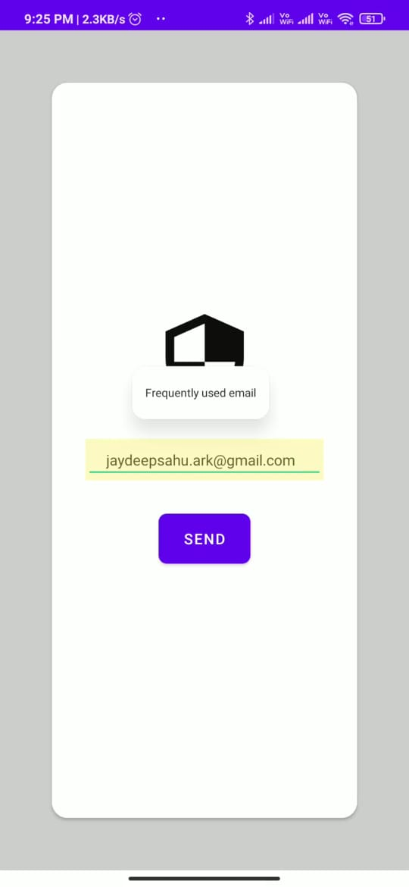
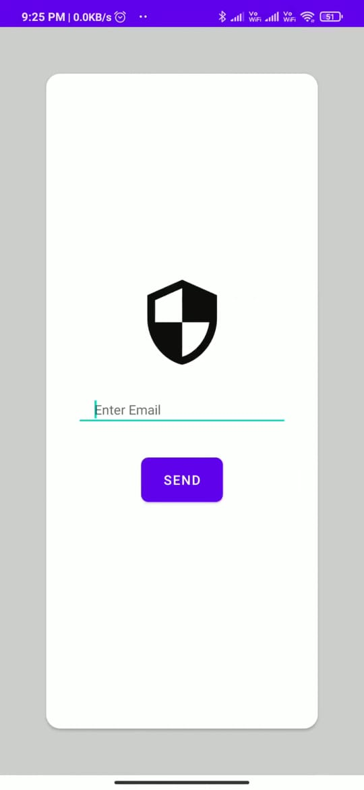

# ChatApp
Chat App:  A social media Android App where we can make friends by accepting the friend request and chat with them. we can share post with them , they can like  and comment on the post.   
 

## Screenshots
Here are a few Screenshots for more intricate details of the app

<table>
  <tr>
    <td></td>
    <td></td>
    <td></td>
  </tr>
 </table>
 <table>
  <tr>
    <td></td>
    <td></td>
    <td></td>
  </tr>
 </table>

 <table>
  <tr>
    <td></td>
    <td></td>
    <td></td>
  </tr>
 </table>
  <table>
  <tr>
    <td></td>
    <td></td>
    <td></td>
  </tr>
 </table>
  <table>
  <tr>
    <td></td>
    <td></td>
    <td></td>
  </tr>
 </table>
  <table>
  <tr>
    <td></td>
    <td></td>
	<td></td>
  </tr>
 </table>

<table>
  <tr>
    
    <td></td>
    <td></td>
	<td></td>
  </tr>
 </table>
 
 <!-- /
  <table>
  <tr>
    <td></td>
    <td></td>
    <td></td>
  </tr>
 </table>
  <table>
  <tr>
    <td></td>
    <td></td>
    <td></td>
  </tr>
 </table>
  <table>
  <tr>
    <td></td>
    <td></td>
  </tr>
 </table>

-->

<!-- /

 -->

<!-- User's App

ent.com/86646962/180577376-3fa26f58-b408-458b-8437-3386ec618538.jpeg)
 -->

